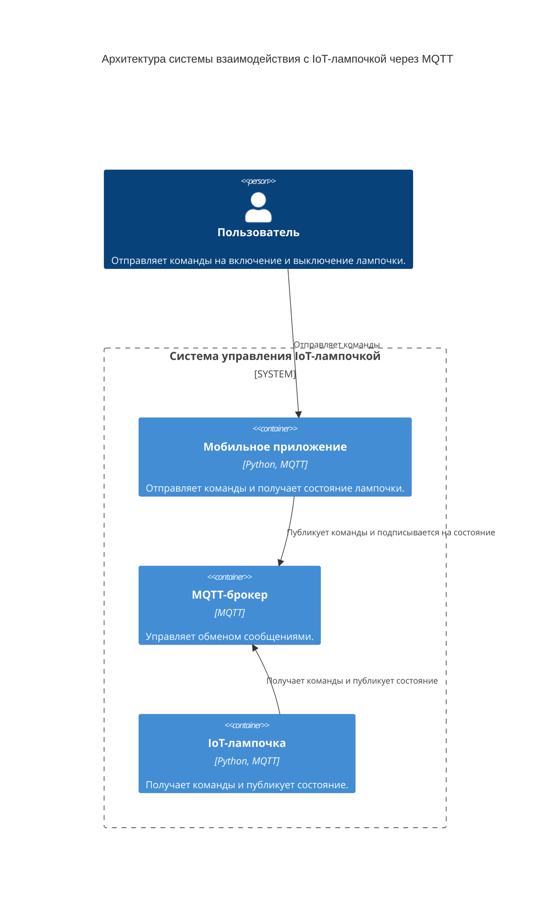
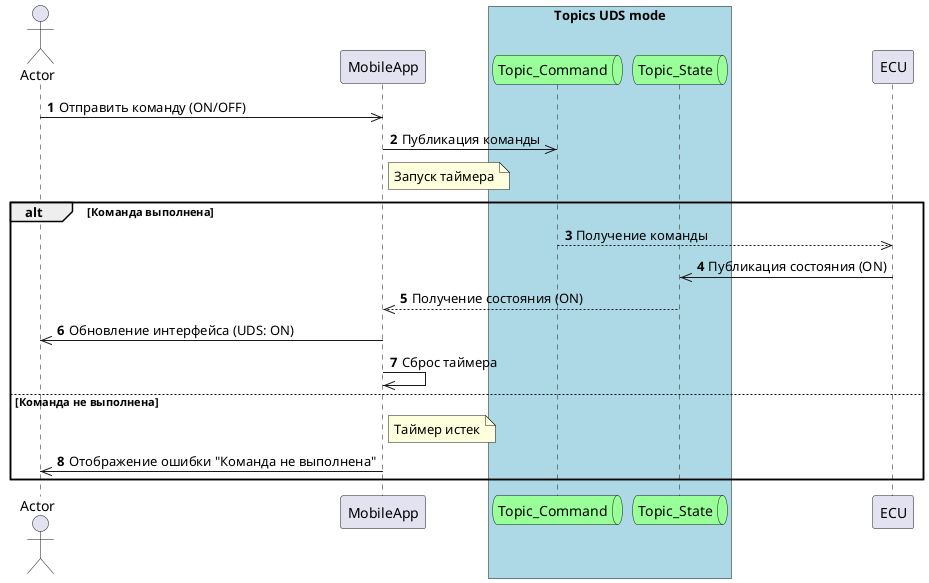

# MQTT_IoT

## Архитектура
Архитектура системы включает следующие компоненты:

1. **Мобильное приложение**: Отправляет команды на включение и выключение лампочки и получает текущее состояние лампочки.
2. **IoT-лампочка**: Получает команды и публикует текущее состояние.
3. **MQTT-брокер**: Управляет обменом сообщениями между мобильным приложением и IoT-лампочкой.



## Функциональные требования

1. **FR_01 Управление лампочкой**: Мобильное приложение должно иметь возможность отправлять команды на включение и выключение ECU.
2. **FR_02 Получение состояния**: Мобильное приложение должно получать текущее состояние UCU (включена/выключена).
3. **FR_03 Обработка ошибок**: В случае, если команда не выполнена, мобильное приложение должно отображать сообщение об ошибке "Команда не выполнена".

## Логика работы

1. **Отправка команды**:
   - Пользователь отправляет команду (ON/OFF) через мобильное приложение.
   - Мобильное приложение публикует команду в топик `command`.

2. **Ожидание ответа**:
   - После отправки команды запускается таймер.
   - Если в течение заданного времени не поступает обновление состояния, выводится сообщение об ошибке.

3. **Получение состояния**:
   - ECU получает команду из топика `command` и выполняет соответствующее действие.
   - После выполнения команды ECU публикует свой текущий статус в топик `state`.
   - Мобильное приложение получает обновление состояния из топика `state` и обновляет интерфейс пользователя.

## Sequence Diagram



## Пример реализации концепта на Python

### Мобильное приложение

```python
import paho.mqtt.client as mqtt
import threading

# Настройки MQTT
BROKER_ADDRESS = "mqtt.example.com"
COMMAND_TOPIC = "command"
STATE_TOPIC = "state"
COMMAND_TIMEOUT = 5  # Таймаут в секундах

# Флаг для отслеживания получения состояния
state_received = False

# Функция обратного вызова при подключении
def on_connect(client, userdata, flags, rc):
    print("Connected with result code " + str(rc))
    client.subscribe(STATE_TOPIC)

# Функция обратного вызова при получении сообщения
def on_message(client, userdata, msg):
    global state_received
    if msg.topic == STATE_TOPIC:
        state_received = True
        print(f"Лампочка: {msg.payload.decode()}")
        # Обновите интерфейс пользователя

# Функция для отправки команды
def send_command(command):
    global state_received
    state_received = False
    client.publish(COMMAND_TOPIC, command)
    # Запуск таймера
    timer = threading.Timer(COMMAND_TIMEOUT, check_command_status)
    timer.start()

# Функция для проверки статуса команды
def check_command_status():
    if not state_received:
        print("Ошибка: Команда не выполнена")
        # Отобразите сообщение об ошибке в интерфейсе пользователя

# Создание клиента MQTT
client = mqtt.Client()
client.on_connect = on_connect
client.on_message = on_message

# Подключение к брокеру
client.connect(BROKER_ADDRESS, 1883, 60)

# Пример использования
send_command("ON")  # Включение лампочки
send_command("OFF")  # Выключение лампочки

# Запуск цикла обработки сообщений
client.loop_forever()
```
## Пример реализации концепта на Python
### IoT лампочка
```python
import paho.mqtt.client as mqtt

# Настройки MQTT
BROKER_ADDRESS = "mqtt.example.com"
COMMAND_TOPIC = "command"
STATE_TOPIC = "state"

# Функция обратного вызова при подключении
def on_connect(client, userdata, flags, rc):
    print("Connected with result code " + str(rc))
    client.subscribe(COMMAND_TOPIC)

# Функция обратного вызова при получении сообщения
def on_message(client, userdata, msg):
    if msg.topic == COMMAND_TOPIC:
        command = msg.payload.decode()
        if command == "ON":
            turn_on()
        elif command == "OFF":
            turn_off()

# Функции для управления лампочкой
def turn_on():
    print("Лампочка включена")
    client.publish(STATE_TOPIC, "ON")

def turn_off():
    print("Лампочка выключена")
    client.publish(STATE_TOPIC, "OFF")

# Создание клиента MQTT
client = mqtt.Client()
client.on_connect = on_connect
client.on_message = on_message

# Подключение к брокеру
client.connect(BROKER_ADDRESS, 1883, 60)

# Запуск цикла обработки сообщений
client.loop_forever()
```
## Преимущества MQTT перед REST API для взаимодействия с IoT-устройствами

Взаимодействие с IoT-устройствами через MQTT имеет несколько преимуществ по сравнению с использованием REST API. Вот основные причины, по которым MQTT часто предпочитают для IoT-приложений:

1. **Эффективность и экономия ресурсов**:
   - **MQTT** использует легковесный протокол, который минимизирует объем передаваемых данных. Это особенно важно для IoT-устройств, которые часто имеют ограниченные вычислительные ресурсы и работают на низкоскоростных сетях.
   - **REST API** требует больше ресурсов для обработки HTTP-запросов и ответов, что может быть неэффективно для устройств с ограниченными возможностями.

2. **Масштабируемость**:
   - **MQTT** поддерживает модель "издатель-подписчик" (publish-subscribe), что позволяет легко масштабировать систему, добавляя новые устройства и клиенты без необходимости изменения архитектуры.
   - **REST API** требует точечного взаимодействия между клиентом и сервером, что может усложнить масштабирование системы.

3. **Надежность и качество обслуживания (QoS)**:
   - **MQTT** поддерживает различные уровни качества обслуживания (QoS), что позволяет гарантировать доставку сообщений даже при ненадежных сетевых соединениях.
   - **REST API** не имеет встроенных механизмов для обеспечения надежной доставки сообщений, что может быть критично для IoT-приложений.

4. **Реальное время**:
   - **MQTT** обеспечивает передачу сообщений в реальном времени, что важно для приложений, требующих мгновенной реакции на изменения состояния устройств.
   - **REST API** обычно используется для запросов и ответов, что может вносить задержки и не подходит для приложений реального времени.

5. **Энергоэффективность**:
   - **MQTT** позволяет устройствам оставаться в режиме низкого энергопотребления, так как они могут подписываться на топики и получать сообщения только при необходимости.
   - **REST API** требует постоянного опроса сервера для получения обновлений, что увеличивает энергопотребление.

6. **Гибкость и простота интеграции**:
   - **MQTT** легко интегрируется с различными устройствами и платформами благодаря своей простоте и поддержке различных форматов сообщений.
   - **REST API** может требовать дополнительных усилий для интеграции с различными устройствами и системами.

Таким образом, MQTT является более подходящим протоколом для взаимодействия с IoT-устройствами благодаря своей эффективности, масштабируемости, надежности и поддержке реального времени.
